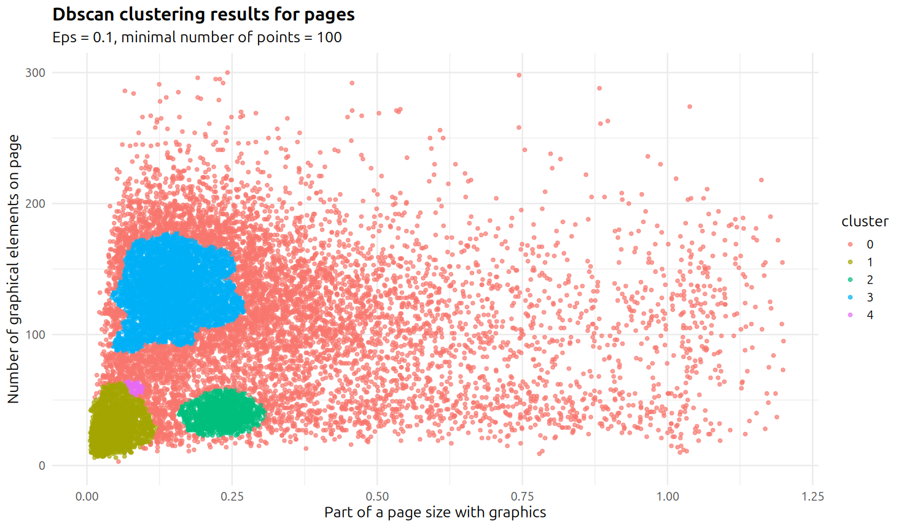

# Academic Titles in "Der Tag" (1900-1920)

Repository for [culture.explore(data) hackathon](https://lab.sbb.berlin/culture-explore-data/) project aimed at exploring an amount of authors with academic titles in the German daily newspaper Der Tag (1900-1920)

## Authors

**Pavlo Myronov**  
📧 [paul.myronov@gmail.com](mailto:paul.myronov@gmail.com)  
🔗 [GitHub Profile](https://github.com/zefmud)

**Kseniia Utievska**
📧 [ks.utievska@gmail.com](ks.utievska@gmail.com)  

## Project idea
Articles in the German daily newspaper (1900–1920) **_Der Tag_** were often authored by individuals with academic titles, such as *Dr.* or *Professor*.  

Intrigued by the fact that a daily newspaper regularly engaged academics as authors, we set out to investigate whether there was any development in the number of authors with academic titles during this period, and whether such changes correlated with major historical events such as World War I or the November Revolution.  

The task seemed feasible for a two-day hackathon, since authorship information usually appeared in the dataset as a single *TextBlock* XML element and seemed to require only a modest amount of data refinement.

## Problems and limitations
We soon discovered that academic titles appeared not only in *TextBlocks* containing author information but also in *TextBlocks* with advertisements — for example, an advertisement for Dr. Oetker’s baking products. To distinguish these cases from genuine authorship mentions, we tried to identify pages containing advertisements. We used the following indicators: the proportion of the page occupied by graphical elements and the total number of graphical elements per page.

Another issue was that the newspaper did not maintain a consistent number of pages. At one point, the number of pages skyrocketed to around 100 per day, while the number of authors with academic titles remained relatively stable.

In the end, we decided to focus on analyzing the first three pages, as they generally contained no advertisements and primarily featured the most important articles.

## Results
We did not find any clear trend in the percentage of pages containing *TextBlocks* with authors’ academic titles. It would be interesting to analyze the newspaper data from the period after 1920 to determine whether the collaboration between the newspaper and academic authors declined in the 1920s.

However, we observed an unexplained oscillation in 1916, when the number of articles authored by academics peaked, with more than 80% of pages containing authors’ academic credentials. A close reading of the newspaper during this particular year would likely shed light on the nature of this phenomenon.

## How to use it
Download the [tar.gz files of the “Der Tag” newspaper](https://lab.sbb.berlin/on-this-day/) and save them in the *archives* folder in the repo directory. Then run the Python scripts *pages_per_date.py* and *extract.py*.  
This will generate two files: *pages.csv* (a list of all page files, with the date extracted from the filename) and *titles.csv* (a list of all detected authorship blocks).  

Afterwards, you can analyze the dynamics by editing and expanding the *analysis.R* script.
